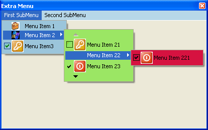



## Extra Menu

### Description

This code uses API functions and changes standard apearance of Menu Control.
 
### More Info
 

             |
---                |---
**Submitted On**   |2006-01-29 21:50:46
**By**             |[djkprojects](https://github.com/Planet-Source-Code/PSCIndex/blob/master/ByAuthor/djkprojects.md)
**Level**          |Intermediate
**User Rating**    |5.0 (55 globes from 11 users)
**Compatibility**  |VB 6\.0
**Category**       |[Custom Controls/ Forms/  Menus](https://github.com/Planet-Source-Code/PSCIndex/blob/master/ByCategory/custom-controls-forms-menus__1-4.md)
**World**          |[Visual Basic](https://github.com/Planet-Source-Code/PSCIndex/blob/master/ByWorld/visual-basic.md)
**Archive File**   |[Extra\_Menu197890392006\.zip](https://github.com/Planet-Source-Code/djkprojects-extra-menu__1-64589/archive/master.zip)

